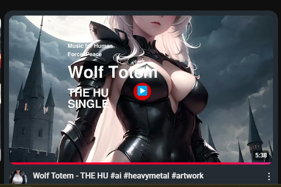
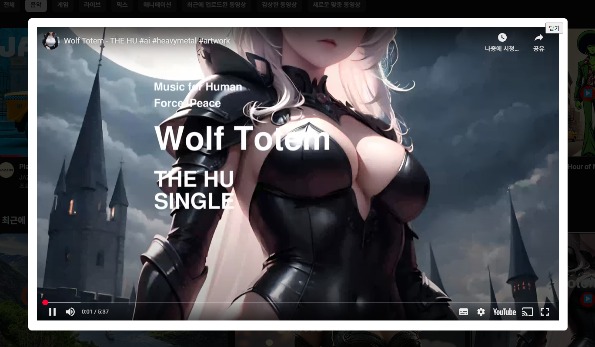
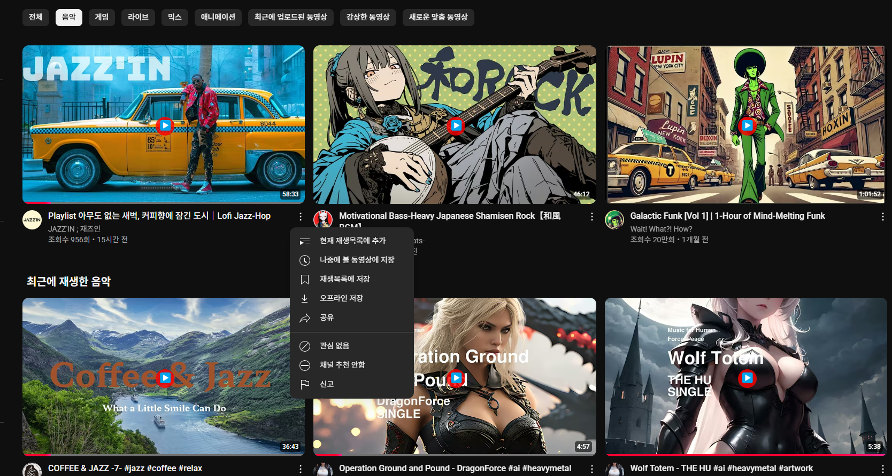
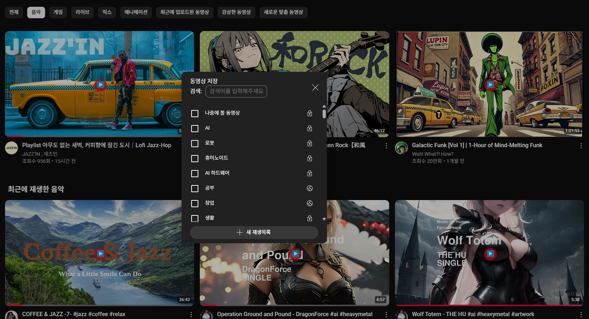
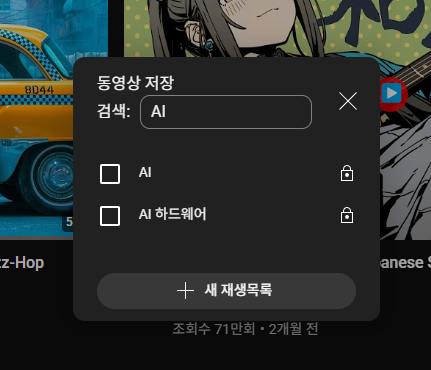
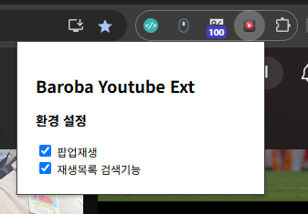

# Baroba Chrome Extention for Youtube.com
This is the BAROBA Chrome browser extension plugin for watching YouTube videos in a popup.

## Extension Description
This extension provides a feature that allows you to view YouTube videos directly in a pop-up. Users can watch videos in a pop-up layer by clicking on the icon added to the thumbnail. The pop-up layer is designed to be easily closed by users.

## Install from Store

- Google : [Chrome Web Store](https://chromewebstore.google.com/detail/baroba-youtube-ext/epeclcdjpbiiiadlnmbjnnaielfmglea)
- Microsoft : Edge Add-ons (In review​)

## How to install Chrome extension plugins in developer mode
1. Open the Chrome browser and go to the Extensions page by typing `chrome://extensions/` in the address bar.
2. Turn on the “Developer Mode” switch in the top right.
3. Click the "Load unpacked extensions" button.
4. Load the extension by selecting the `Baroba-YouTube-Ext/dist/` folder.
5. Once the extension is successfully installed, you will see an icon added to thumbnails on the YouTube website.

## How to Use
1. Go to the YouTube website.
2. Click the icon that appears on the thumbnail of the video you want.
3. Watch the video in a pop-up layer.
4. When you are finished watching the video, click the 'Close' button to close the pop-up.

## Developer Information
- Name: Baroba
- Website: [www.baroba.kr](https://www.baroba.kr)

## Features

The following are the features of Baroba Chrome Extensions for YouTube.

### Popup View

This feature allows you to watch YouTube videos in a popup without entering the video page. Click the play button displayed in the center of the thumbnail to show the video in a popup.

Popup View Image 1 - Popup Play Button

Popup View Image 2 - Popup Play Screen

### Playlist Search

When you find a good video and want to add it to a playlist, it can be difficult to find the right playlist among many playlists. That's why we've added a simple search function.

Playlist Search Image 1 - Add to Playlist Button

Playlist Search Image 2 - Save Video

Playlist Search Image 3 - Playlist Search

### Settings

You can turn on/off the popup view and playlist search features in the settings window.

Settings Window
